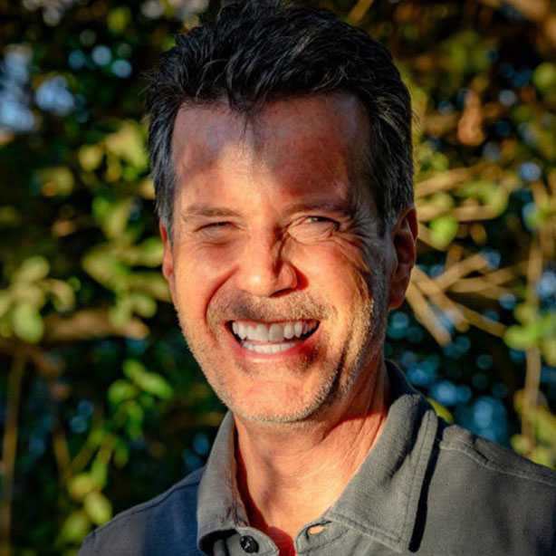
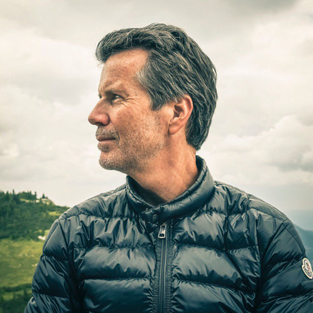

 

<!-- section 1 -->



##  Owen Kemp

#### #ITexecutive #emergingmarkets #consultant #cloud #edgecomputing #smartcities #businessdevelopment #partnerships #worldtraveller #optimist #anarchist



 

<!-- section 2 -->



|||





<spain class="font-bold">At Work.</spain> AOwen is an experienced executive in the IT space, having led several multi-billion dollar businesses for HP in all world-wide markets. He was responsible for HP’s world-wide Finance Industry business, launched HP in to the emerging markets of Sub-Saharan Africa and Middle East and ran HP’s subsidiary in Russia with an emphasis on improving balance of trade, R&D and corporate citizenship.

Since leaving HP, Owen has focused on assisting start-ups (early to late stage) with his broad management and market experience. Among others he has worked with cutting-edge companies in Cloud- and Edge computing; Smart City technologies; Eco-Tech; Fin-Tech; Reg-Tech and Digital Marketing; Block-chain and Cryptocurrency.

In addition to working with Private Equity funds in New York, Russia and Austria, he was also advising various Family Offices. He is also an advisor to the Austrian Government in attracting foreign investment to Austria.

Owen is a professional management consultant, coach and mentor and has helped many companies in improving their strategy including business development, internationalisation, Go-To-Market and partnership strategy, recruitment and more.

Owen has known and worked with Kristof de Spiegeleer since 2011 and is now fully on board of the ThreeFold Foundation and TF Tech.

<spain class="font-bold">Inspiration.</spain> n all walks of life, I look for an equitable exchange of value and believe in doing everything in a socially responsible way. I love working with diverse teams as they best represent our amazing planet. Emerging markets have been my passion and my profession. Once described as an optimist and anarchist, I love doing things in an unconventional way. All of this and more has led me to Incubaid.

<spain class="font-bold">At Play.</spain> Outside of work, you can find me outside – skiing (when the weather allows), biking, hiking, and gardening. I have been to 147 countries on last count, so one might say I like to travel.





<button>[Previous](/people/peter)</button>
<button>[Next](/people/kds)</button>



