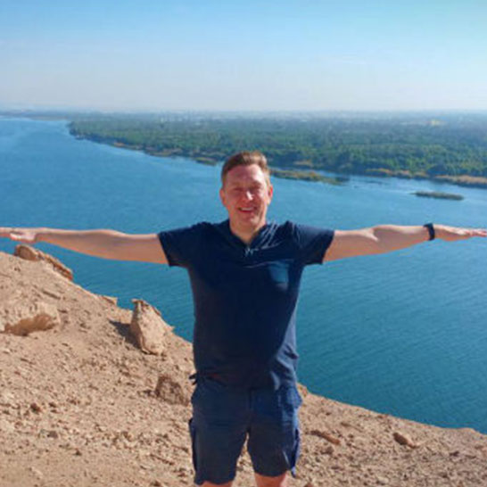
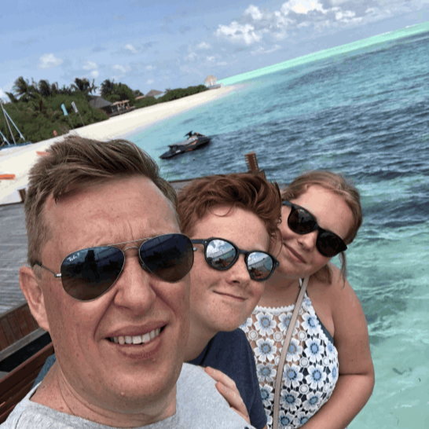

 

<!-- section 1 -->



##  Peter Van de Henst

#### #finance #humanresources #startup #coworking #community #footballaddict #rockthenation



 

<!-- section 2 -->



|||





<spain class="font-bold">At Work.</spain>  As a Finance & HR manager, I am a leading support for all companies and for people working for these companies.

<spain class="font-bold">Inspiration.</spain>  Since I am also supporting several starting companies from my own side-business (Idola Business Center) it's a logical step to help and guide start-ups from this incubator. Investing is the future where creating is core. The right people with the appropriate experience in this matter will help them grow. I am thrilled to share my experience with them for a better future.

<spain class="font-bold">At Play.</spain> I am addicted to football, fun and music. Even with my age, I am still an active football player. And to prepare for my future age, I am learning to play electric guitar so I can keep rocking the nation.





<button>[Previous](/people/jan)</button>
<button>[Next](/people/owen)</button>



